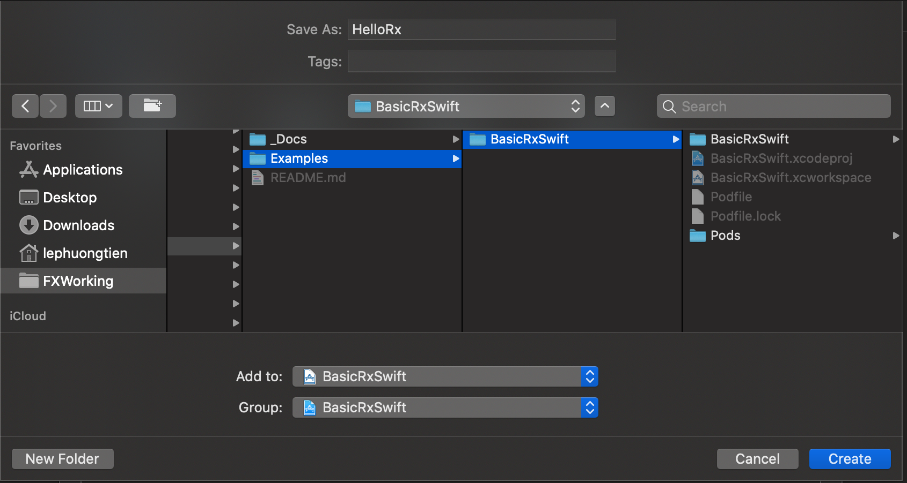
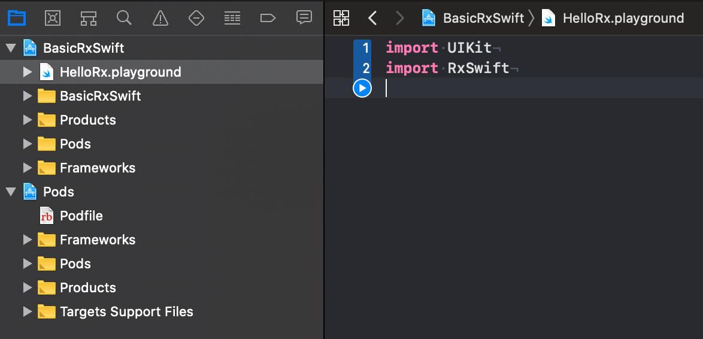

# 02 Hello RxSwift

>Các bạn đã đi qua phần Giới thiệu khá là lèn nhèn và khó hiểu. Lời khuyên chân thành là bạn cũng đừng xa lầy vào đám lý thuyết hỗn độn đó. Tốt nhất là khi đi qua hết các kiến thức cơ bản thì hãy quay lại đọc nó. Khi đó bạn vừa ôn tập lại kiến thức cũ vừa hiểu kĩ hơn về bản chất. Cái này áp dụng cho đa số các kiến thức khác mà bạn tìm hiểu.

## Tham khảo

* Github RxSwift: https://github.com/ReactiveX/RxSwift
* Github họ hàng nhà Rx: https://github.com/ReactiveX
* Cộng đồng: http://community.rxswift.org/
* Github của tụi cộng đồng: https://github.com/RxSwiftCommunity

## Installing RxSwift

Mọi việc bắt đầu từ việc cài đặt RxSwift. Bạn truy cập vào link repo trên Github của RxSwift. Mình sẽ cài đặt thông qua CocoaPod. Bạn có thể đọc hết cũng được nhưng chỉ cần quan tâm tới đoạn Pod này thôi

```shell
# Podfile
use_frameworks!

target 'YOUR_TARGET_NAME' do
    pod 'RxSwift', '~> 5'
    pod 'RxCocoa', '~> 5'
end

# RxTest and RxBlocking make the most sense in the context of unit/integration tests
target 'YOUR_TESTING_TARGET' do
    pod 'RxBlocking', '~> 5'
    pod 'RxTest', '~> 5'
end
```

Về RxSwift sẽ gồm 2 phần chính

* RxSwift dành cho ngôn ngữ Swift
* RxCocoa dành cho nền tảng iOS

Ngoài ra, bạn cũng thấy Rx cũng len lỏi vào testing. Nhưng mà chúng ta tạm thời không cần quan tâm nhiều làm gì.

Tiếp theo, bạn tạo 1 project mới bằng Xcode. Sau đó tiến hành cài đặt `CocoaPod` lên project đó. Nếu bạn chưa biết CocoaPod là gì thì hãy làm vài đường Google để được khai sáng.

Sau khi cài xong thì edit `Podfile` bằng đoạn pod ở trên và chạy lệnh `pod install`. Cuối cùng bạn mở project lên và tiến hành `import RxSwift` mà không báo lỗi thì bạn đã thành công rồi. Giờ sang phần tiếp theo nào!

## Play Playground

Các phần đầu tiên đa số tập trung vào lý thuyết nên `Playground` là phương pháp thực hành nhanh nhất. Nhưng một điều cản trở là Playground không cài đặt RxSwift được. Mà các bạn dev thường rất ít khi tìm hiểu xâu hơn. Sau đây mình sẽ hướng dẫn luôn. 

Mở file `*.xcworkspace` lúc nãy bạn tạo ra bằng việc `pod init` . Vì đã cài đặt RxSwift cho project đó rồi nên chúng ta oke về mặt thư viện. Bạn tiến hành `New File > Playgournd`. Điều chú ý ở đây chính là:

* Nơi lưu file playground chính là thư mục project
* Add vào `workspace` & `Group` là project đó luôn để sử dụng được các thư viện đã cài đặt trong Pod



Và bạn cũng tiến hành `import RxSwift` vào file Playground đó. Nếu không có lỗi gì xãy ra thì bạn thành công thêm một bước nữa rồi. Còn nếu có lỗi thì bạn hãy tắt xcode đi và mở lại nó. 80% lỗi được khắc phục bằng cách đơn giản như vậy!



Bạn có thể xem qua về cấu trúc file của Workspace này. Lần sau, bạn muốn tạo thêm Playground khác để luyện tập với RxSwift thì cũng nên áp dụng tương tự.

> Tới đâu thì mình càng yêu quý `Combine` nhiều hơn. Vì nó cũng là họ hàng nhà Rx và nó được build sẵn vào trong core OS. Vì vậy có thể sử dụng mọi lúc mọi nơi mà không cần phải rườm ra như thế này. Hàng chính chủ vẫn là xịn xò nhất.

## Hello RxSwift

Để tới được đây thì cũng tốn công sức quá. Chúng ta đi nhanh vào vấn đề chính nào. Bạn mở file `HelloRx.playground` và thêm đoạn code này vào.

```swift
    let helloRx = Observable.just("Hello RxSwift")
    helloRx.subscribe { (value) in
        print(value)
    }
```

Sau đó bấm thực thi Playground và xem kết quả.

```
next(Hello RxSwift)
completed
```

Nếu bạn chạy ra đúng như vậy thì chúc mừng bạn đã hoàn thành bài hôm nay. Còn mình sẽ giải thích sơ cho bạn hiểu như sau:

* `helloRx` là 1 biến kiểu là `Observable` 
* Observable này là nguồn phát ra dữ liệu, trong ví dụ thì kiểu dữ liệu phát ra chính là `String` 
* `just` là ám chỉ việc Observable này được tạo ra và phát đi 1 lần duy nhất, sau đó sẽ kết thúc. 
* Dữ liệu phát đi chính là chữ `Hello RxSwift`
* Để lắng nghe những gì mà `helloRx` phát ra thì bạn cần `subscribe` thôi. 
* Chúng ta cần cung cấp 1 closure để xử lí các giá trị nhận được từ nguồn phát. 
* Về giá trị nhận được
  * Sau khi phát ra `Hello RxSwift` thì sẽ phát ra tín hiệu kết thúc `completed`.

Vậy đó là tất cả những gì cho bài Hello RxSwift. Hẹn gặp bạn ở bài sau!