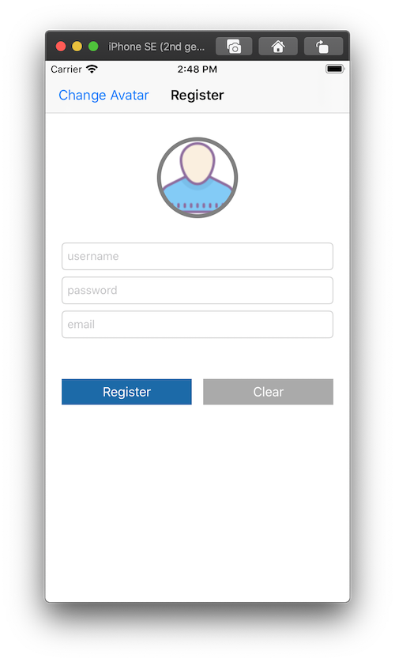

# 08.1 Hello ViewController

Phần này chúng ta làm quen với việc dùng RxSwift cho ViewController. Các bạn sẽ bắt đầu tạo và cài đặt và dần dần quen với phong cách lập trình Reactive Programming.

Để làm ví dụ code demo minh hoạ cho từng phần lý thuyết thì bạn hãy sử dụng project ví dụ của mình. Nó cũng trong repo này.

* **Link:** [checkout](../Examples/BasicRxSwift)
* **Thư mục:** `/Examples/BasicRxSwift`

Project khá đơn giản với 1 màn hình Register lúc ban đầu. Sau này qua các màn hình khác thì sẽ thêm một vài màn hình nữa. Xem qua giao diện thì như thế này.



### Setup

Mọi thứ sẽ bắt đầu từ việc import thư viện. Bạn mở Project lên và thêm đoạn import này vào. 

```swift
import RxSwift
import RxCocoa
```

Và toàn bộ code của màn hình RegisterViewController ban đầu như sau:

```swift
import UIKit
import RxSwift

class RegisterViewController: UIViewController {
    
    // MARK: Outlets
    @IBOutlet weak var avatarImageView: UIImageView!
    @IBOutlet weak var usernameTextField: UITextField!
    @IBOutlet weak var passwordTextField: UITextField!
    @IBOutlet weak var emailTextField: UITextField!
    @IBOutlet weak var registerButton: UIButton!
    
    // MARK: Properties
    var avatartIndex = 0
    
    // MARK: Life cycle
    override func viewDidLoad() {
        super.viewDidLoad()
        title = "Register"
        
        configUI()
    }
    
    // MARK: Config
    func configUI() {
        avatarImageView.layer.cornerRadius = 50.0
        avatarImageView.layer.borderWidth = 5.0
        avatarImageView.layer.borderColor = UIColor.gray.cgColor
        avatarImageView.layer.masksToBounds = true
        
        let leftBarButton = UIBarButtonItem(title: "Change Avatar", style: .plain, target: self, action: #selector(self.changeAvatar))
        self.navigationItem.leftBarButtonItem = leftBarButton
    }
    
    // MARK: Actions
    @IBAction func register(_ sender: Any) {
    }
    
    @IBAction func clear(_ sender: Any) {
    }
    
    @objc func changeAvatar() {
        avatarImageView.image = UIImage(named: "avatar_1")
    }
    
}
```

ViewController này cũng không quá cho đối với bạn. Giờ chúng ta bắt đầu vào việc chính với RxSwift nào. Phần này bạn phải xác định 2 đối tượng tối quan trọng nhất trong 1 ViewController khi làm việc với RxSwit:

#### DisposeBag

Đây là thành phần tối tượng đầu tiên cần phải có. Bạn sẽ nhờ đó giải quyết rất nhiều `subscription` mà không cần quan tâm tới bộ nhớ hay bất cứ gì phát sinh ra mà ảnh hưởng tới bộ nhớ của app bạn. 

Bạn tạo một `property` mới cho **RegisterViewController** như sau:

```swift
    private let bag = DisposeBag()
```

Tuỳ thuộc vào ViewController của bạn đóng vài trò như thế nào trong một `flow` màn hình. Thì bạn sẽ có cách giải phát các `subscription` riêng theo. Còn với ví dụ này thì khi nào ViewController giải phóng thì `bag` sẽ giải phóng theo. Đi theo `bag` là các `subscription` của nó cũng bay hơi theo.

### Observable Properties

Mình gọi chung là `Observable` cho các `properties` của ViewController. Nó có thể là:

* Observable
* Subject
* Traits

Về ví dụ demo, chúng ta sẽ tạo 1 property quản lý `avatart` như sau:

```swift
private let image = BehaviorRelay<UIImage?>(value: nil)
```

Tại sao là `Relay` , vì:

* nó không bao giờ kết thúc
* Dữ liệu của nó sẽ liên quan tới dữ liệu của một UI Control trong View

> Người tiền nhiệm của nó trong RxSwift trước đây là `Variable`.

Còn việc chọn `BehaviorRelay` là vì mong muốn lúc nào cũng phải có giá trị khi có `subscriber` đăng ký tới. Còn kiểu dữ liệu là `UIImage?` để phù hợp với `avatartImageView.image`.

Còn sử dụng nó thì như sau:

* Cách phát đi 1 dữ liệu 

```swift
image.accpet(UIImage(...))
```

* Cách lấy giá trị hiện tại của nó 

```swift
image.value
```

### Action

Phần setup là dành cho các properties và outlet. Sang phần Action chính là xử lý các sự kiện mà người dùng tác động lên giao diện. Trong ví dụ, thì bạn mở function `changeAvatar` và thêm phần xử lý này vào

```swift
@objc func changeAvatar() {
        let img = UIImage(named: "avatar_1")
        image.accept(img)
    }
```

Khá là đơn giản phải không nào. Bạn chỉ cần tạo ra dữ liệu và bắn nó đi thôi thông qua toán tử `.accept`. 

> Chắc tại đây cũng nhiều bạn thắc mắc sao không sử dụng `button.rx.tag`. Thì mình trả lời là để dành phần sau.

### Subscribe

Nối tiếp với việc `emit` dữ liệu là việc `subscribe` để nhận được dữ liệu. Việc subcribe thì chúng ta đã làm nhiều rồi. Nhưng quan trọng trong đó là phải cập nhật UI lại với dữ liệu mới. Quay về code demo thì bạn truy cập tới `viewDidLoad` của RegisterViewController và thêm code subscribe vào

```swift
override func viewDidLoad() {
        super.viewDidLoad()
        title = "Register"
        
        configUI()
        
        //subscription
        image
            .subscribe(onNext: { img in
                self.avatarImageView.image = img
            })
            .disposed(by: bag)
    }
```

Toàn là kiến thức cũ thôi. Vì `BehaviorRelay` cũng là một `Subject`, nên hoàn toàn có thể `subscribe` nó. Bạn chỉ cần quan tâm tới `.onNext` mà thôi. Các trường hợp `error` hay `completion` là không bao giờ xảy ra với `Relay`.

> Khi bạn làm quen với Reactive Programming rồi, thì việc thiết lập các `subscriber` này bạn sẽ làm lúc ban đầu luôn. Mọi thứ sẽ được khai báo (từ outlet tới action đều đc Rx hoá ....) và chỉ cần tương tác 1 phát là kéo theo các sự thay đổi khác diễn ra. Quá trình này hoạt động tự động và độc lập với nhau.

Và khi bạn muốn `BehaviorRelay` có thêm `error` hay `completed` thì có thể biến đổi một chút như sau:

```swift
image.asObservable()
            .subscribe(onNext: { img in
                self.avatarImageView.image = img
            })
            .disposed(by: bag)
```

Toán tử `asObservable()` sẽ xoá đi mọi khoảng cách để chúng ta thêm tự tin gần nhau hơn.

Ngoài ra, bạn có thể xử lý để áp dụng cho nhiều thay đổi lên nhiều UI Control trong ViewController với mỗi lần nhận được dữ liệu. Ví dụ như sau:

```swift
func updateUI() {
	// thay đổi Lable
	
	// thay đổi Button
	
	// update Tableview
	
	// ...
}
```

Update lại chỗ `subcriber` thì như sau:

```swift
images.asObservable()
		.subscribe(onNext: { [weak self] photos in
				self?.updateUI() 
				})
		.disposed(by: bag)
```

---

OKAY! Chúng ta đã `Hello ViewController` xong. Phần vui còn ở phía trước!

