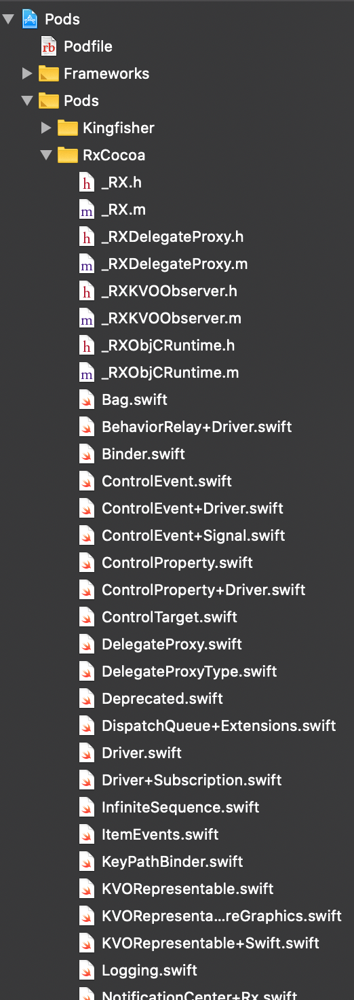

# 10.1 Display Data

Nhiệm vụ của View là chúng sẽ hiển thị dữ liệu cho người dùng xem và nhận sự kiện của người dùng. Thì việc chúng ta cần phải clear nó và nắm được 2 luồng cơ bản

* Luồng dữ liệu
* Luồng sự kiện

> Đó là bản chất của lập trình.

### Chuẩn bị

Vẫn sử dụng tiếp project từ lúc đầu đến bây giờ. Vì đơn giản là mình lười mà thôi. Tất nhiên nó vẫn đủ sài cho mình và bạn. Nếu bạn đã quên nó ở đâu rồi thì có thể checkout tại đây:

* **Link:** [checkout](../Examples/BasicRxSwift)
* **Thư mục:** `/Examples/BasicRxSwift`

Về màn hình cho phần này thì bạn sẽ thấy file `WeatherCityViewController.swift`. Nó dùng để show thông tin thời tiết của một thành phố. Tên thành phố là do chúng ta nhập vào. Tất nhiên, dữ liệu chúng ta sẽ lấy từ API (mình sẽ tìm API thời tiết sau cho bạn).

### 1. Tổng quan RxCocoa

Để xem qua bạn có thể vào phần `Pod project` và show ra phần `RxCocoa`. Nó khá là rất rất nhiều file. Hơi loạn một chút



Mình chỉ show ra chừng đó thôi, chứ còn nhiều lắm. Bạn thử vào 1 file như là `UITextField+Rx.swift` xem thử có gì trong đó.

Cũng không nhiều lắm, tuy nhiên bạn sẽ thấy được vài thuộc tính điển hình như

```swift
    /// Reactive wrapper for `text` property.
    public var text: ControlProperty<String?> {
        return value
    }
```

Bạn cũng có thể đoán được, nó sẽ được `Rx` hoá và chúng ta sẽ dùng được nó. ... vâng vâng và mây mây. Chúng ta sẽ tìm hiểu hết tất cả chúng trong các phần tiếp sau.

> Đừng sa lầy vào đây nữa. Loạn rồi!

### 2. Subscribe

> View có nhiệm vụ là hiển thị dữ liệu.

Vì chúng ta trong thể giới `Rx` nên dữ liệu của chúng ta không đơn thuần là gán giá trị cho các thuộc tính của UI Control trên View. Dữ liệu sẽ được phát ra từ một nguồn phát (Observable) nào đó.

Để chuẩn bị dữ liệu cho Giao diện của chúng ta thì cần phải thêm các file model sau

- `Weather.swift` file này sẽ chứa class/struct với các thuộc tính tương đồng với dữ liệu dùng để hiển thị lên UI. Bạn tham sao code sau cho nó
  - Bạn nên sử dung protocol `Decoable` để nó có thể map trực tiếp dữ liệu JSON từ API và biết thành đối tượng một cách nhanh chóng

```swift
struct Weather: Decodable {
    let cityName: String
    let temperature: Int
    let humidity: Int
    let icon: String
}
```

* `WeatherAPI.swift` Đây là file Model có nhiệm việc kết nối với API, phân tích dữ liệu và trả về cho nơi nào gọi nó. Bạn tham khảo code như sau
  * Vì class này sẽ có các đối tượng hay function liên quan tới RxSwift nên cần `import RxSwift`
  * Cũng vì lười nên mình 1 singleton đơn giản là 1 biến `static` thôi

```swift
import Foundation
import RxSwift

class WeatherAPI {
    
    // MARK: - Singleton
    static var shared = WeatherAPI()
    
    // MARK: - Properties
    
    // MARK: - init
    init() { }
    
    // MARK: - private methods
    
    // MARK: - public methods
}
```

Chúng ta đã có 2 file Model chuẩn bị cho phần dữ liệu của ứng dụng. Giờ để test thử cơ chế `subscribe` trong RxSwift hoạt động như thế nào trong project của mình với nhiều UI Controll cần dữ liệu từ nó. Chúng ta sẽ dùng `dummy data` trước. Nếu mọi việc OKE thì sẽ tiến hành connect API để lấy dữ liệu sau.

Bạn mở file `WeatherAPI.swift` và thêm function sau vào:

```swift
    func currentWeather(city: String) -> Observable<Weather> {
        return Observable<Weather>.just(
            Weather(cityName: "Fx Studio",
                    temperature: 99,
                    humidity: 99,
                    icon: iconNameToChar(icon: "01d"))
        )
    }
```

Trong đó:

* `currentWeather` sẽ trả về dữ liệu cho tên `city` được truyền vào
* Function sẽ return về 1 `Observable` với kiểu dữ liệu là `Weahter`
* Vẫn là toán tử huyền thoại `Observable.just`
* Trong closure đó ta tạo mới 1 đối tượng Weather và gởi nó về thôi.

Chú ý chỗ `iconNameToChar` thì bạn thêm function sau

* Dó dựa theo link này của API mình định sử dụng, link mô tả mã của icon với hình thời thiết
* http://openweathermap.org/weather-conditions
* Có điều kiện thì bạn hay tìm hình ảnh xịn sò hơn nha. Mình dùng tạm các emoji của MacOS

```swift
public func iconNameToChar(icon: String) -> String {
  switch icon {
  case "01d":
    return  "🌕"
  case "01n":
    return "🌕"
  case "02d":
    return "🌤"
  case "02n":
    return "🌤"
  case "03d", "03n":
    return "☁️"
  case "04d", "04n":
    return "☁️"
  case "09d", "09n":
    return "🌧"
  case "10d", "10n":
    return "🌦"
  case "11d", "11n":
    return "⛈"
  case "13d", "13n":
    return "❄️"
  case "50d", "50n":
    return "💨"
  default:
    return "E"
  }
}
```

Tạm ổn cho setup và dummy data của Model. Giờ chúng ta lại sang file `WeatherCityViewController.swift`. Cũng như phần làm việc với UIKit thì bạn cũng bắt đầu với import 2 thư viện `RxSwift` & `RxCocoa` 

Đầu tiên là túi rác quốc dân. Nó sẽ giúp bạn giải quyết rác sinh ra do quá trình hoạt động của ViewController. Bạn sẽ yên tâm về mặt bộ nhớ khi có mặt nó trong code của bạn.

```swift
let bag = DisposeBag()
```

Tại function `viewDidLoad`, tiến hành `subcribe` nào

```swift
override func viewDidLoad() {
        super.viewDidLoad()
        configUI()
        
        WeatherAPI.shared.currentWeather(city: "")
            .observeOn(MainScheduler.instance)
            .subscribe(onNext: { weather in
                // code here ...
            })
            .disposed(by: bag)
    }
```

Quá là quen thuộc rồi. Mình sẽ lượt sơ lại cho bạn ôn bài cũ

* `WeatherAPI.shared` dùng đối tượng singleton đơn giản ở trên để gọi function `currentWeather`
* Giá trị trả về là 1 Observable, nhưng ta hiểu là nó sẽ là dữ liệu từ việc connect API do đó cần phải `observeOn` tại MainThread
* Cuối cùng là `disposed` với `bag` vừa tạo

### 3. Model to UI Control

Ta có Mode và đã có dữ liệu rồi. Cũng đã subcriber luôn rồi. Giờ là phần hiển thị data lên UI Control thôi. Edit tiếp đoạn code subcribe trên như sau:

```swift
WeatherAPI.shared.currentWeather(city: "")
            .observeOn(MainScheduler.instance)
            .subscribe(onNext: { weather in
                self.cityNameLabel.text = weather.cityName
                self.tempLabel.text = "\(weather.temperature) °C"
                self.humidityLabel.text = "\(weather.humidity) %"
                self.iconLabel.text = weather.icon
            })
            .disposed(by: bag)
```

Các đối tượng `cityNameLabel` ... là các IBOutlet của `WeatherCityViewController`. Nếu dữ liệu nào là String thì gán trực tiếp. Còn dữ liệu nào Int thì cần biến đổi thêm xí.

Bạn hãy build và xem kết quả đã oke chưa. Bạn chú ý với tham số `city` trong lời gọi hàm là `""` nhưng kết quả là `"Fx Studio"`, thì đó là dummy data mà ta đã tạo trước rồi.

Tới đây, bạn đã hoàn thành được chiều đầu tiên của công việc này.

> Đưa dữ liệu hiển thị lên UI Control

### 4. UI Control to Model

Tiếp tục với chiều ngược lại. Lần này dữ liệu sẽ là từ UI Control đưa về cho Model giải quyết. Trong bài demo này thì chúng ta sử dụng một `UITextField` . Nó được dùng để nhập tên thành phố.

Bạn mở file `UITextField+Rx.swift` trong không gian RxCocoa ở Pod thư mục. bạn sẽ thấy thuộc tính sau:

````swift
public var text: ControlProperty<String?> {
        return value
    }
````

Thuộc tính `text` này là 1 `ControlProperty`. Thực thể này khá là thú vị. Vì nó kết hợp 

* ObservableType
* ObserverType

Bạn có thể subcribe tới nó và có thể thêm giá trị mới vào cho nó. Okay, chúng ta sẽ có 1 bài về em nó sau nha. Giờ sử dụng em nó nào.

```swift
searchCityName.rx.text.orEmpty
            .filter { !$0.isEmpty }
            .flatMap { text in
                return WeatherAPI.shared.currentWeather(city: text).catchErrorJustReturn(Weather.empty)
            }
```

Cũng tại function `ViewDidLoad` của `WeatherCityViewController` , bạn tiến hành sử dụng thuộc tính `text` trên. Và muốn truy cập vào nó bạn hãy gõ `.rx` trước. Đó là không gian của `Reactive` có trong RxCocoa.

`.orEmpty` để đảm bảo nếu `emit` giá trị là `nil` thì chúng sẽ biến thành `""`. Và dùng `.filter` để lọc đi những giá trị là rỗng. Cuối cùng là `flatMap` để biến đổi từ Text thành 1 Observable. Bằng việc gọi tới function `currentWeather` ở trên.

Nếu trong quá trình làm việc (gọi API) mà lỗi thì sẽ nhận được 1 Error, tuy nhiên với `catchErrorJustReturn` thì bắt phát chốt. Không cho nó thoát.

> `catchErrorJustReturn` sẽ xuất hiện khi có Error trong quát trình gọi API. Mà hiện tại chúng ta đang làm dummy toàn bộ. Nên khó mà thấy được.

Bạn cập nhập lại file `Weather.swift` với 2 biến `stactic` mới là `empty` & `dummy`

```swift
    static let empty = Weather(
      cityName: "Unknown",
      temperature: -1000,
      humidity: 0,
      icon: iconNameToChar(icon: "e")
    )

    static let dummy = Weather(
      cityName: "Fx Studio",
      temperature: 20,
      humidity: 90,
      icon: iconNameToChar(icon: "01d")
    )
```

Và tiếp tục sửa lại function `currentWeather` của file `WeatherAPI` . Với việc sử dụng dữ liệu từ param

```swift
    func currentWeather(city: String) -> Observable<Weather> {
        return Observable<Weather>.just(
            Weather(cityName: city,
                    temperature: 99,
                    humidity: 99,
                    icon: iconNameToChar(icon: "01d"))
        )
    }
```

Quay lại file `WeatherCityViewController` thì ta đã lấy được sự kiện gõ text từ TextField và cũng biến đổi nó thành 1 `Observable<Weather>` rồi. Việc tiếp theo là `subcribe` nó. Edit lại nó như sau:

```swift
    searchCityName.rx.text.orEmpty
        .filter { !$0.isEmpty }
        .flatMap { text in
            return WeatherAPI.shared.currentWeather(city: text).catchErrorJustReturn(Weather.empty)
        }
        .observeOn(MainScheduler.instance)
        .subscribe(onNext: { weather in
            self.cityNameLabel.text = weather.cityName
            self.tempLabel.text = "\(weather.temperature) °C"
            self.humidityLabel.text = "\(weather.humidity) %"
            self.iconLabel.text = weather.icon
        })
        .disposed(by: bag)
```

Tới đây, bạn hay build project và thử thay đổi giá trị của TextField. Xem thử `cityNameLabel` của bạn có update theo không. Nếu đã update thì chúc mừng bạn đã thành công cho việc đưa dữ liệu từ UI Control về Model.

> UITextField ---> `.filter` ---> `flatMap` to Observable ---> `subscribe`

Đó là sơ đồ mô tả cho công việc trên. Để giúp bạn có cái nhìn tổng quát hơn xí.

### 5. Display Data from API

Hiển nhiên, dữ liệu dummy data từ Model không phải là cái mà chúng ta quan tâm. Nó chỉ giúp chúng ta kiểm tra xem việc cài đặt và thiết lập mọi thứ đã hoạt động nhịp nhàng hay chưa mà thôi. Vì chúng ta đã setup mọi thứ OKE rồi. Giờ sang công việc cuối cùng là lấy dữ liệu từ API về.

#### 5.1. Weather API

Thông tin về API

* Weather API : [https://openweathermap.org/](https://openweathermap.org/)

Bạn đăng ký một tài khoản và lấy `API Key` để sử dụng cho việc gọi các link API từ server. Chỉ cần vài nốt nhạc là oke thôi.

Link API chúng ta sử dụng là:

* Current Weather : [https://openweathermap.org/current](https://openweathermap.org/current)
* Search by city name

Hoặc bạn có thể tìm 1 API khác để sử dụng cho bài demo. Nhưng về bản chất thì sẽ giống nhau.

#### 5.2. JSON to Object

Tiến hành phân tích cấu trúc JSON từ API trả về. Ta có mẫu JSON như sau

```json
{
    coord: {
        lon: -0.13,
        lat: 51.51
    },
    weather: [
        {
        id: 801,
        main: "Clouds",
        description: "few clouds",
        icon: "02n"
        }
    ],
    base: "stations",
    main: {
        temp: 10.74,
        feels_like: 8.36,
        temp_min: 10,
        temp_max: 12,
        pressure: 1020,
        humidity: 81
    },
    visibility: 10000,
    wind: {
        speed: 2.6,
        deg: 230
    },
    clouds: {
        all: 15
    },
    dt: 1599364473,
    sys: {
        type: 1,
        id: 1414,
        country: "GB",
        sunrise: 1599369706,
        sunset: 1599417370
    },
    timezone: 3600,
    id: 2643743,
    name: "London",
    cod: 200
}
```

Cấu trúc này khá là ói ăm khi `name` chỉ có thể lấy trực tiếp. Còn 3 properties còn lại nó nằm trong cấu trúc `main`. Mà chúng lại không giống tên của properties `Weather`.

Ông trời không tuyệt đường sống của ai bao giờ. Bạn update  `Weather` lại như sau:

* Thêm 1 struct cho `main`

```swift
    private struct AdditionalInfo: Decodable {
      let id: Int
      let main: String
      let description: String
      let icon: String
    }
```

* Thêm các `CodingKey`

```swift
    enum CodingKeys: String, CodingKey {
      case cityName = "name"
      case main
      case weather
    }

    enum MainKeys: String, CodingKey {
      case temp
      case humidity
    }
```

* Thêm function `init` để thực hiện việc `decode`

```swift
    init(from decoder: Decoder) throws {
      let values = try decoder.container(keyedBy: CodingKeys.self)
      cityName = try values.decode(String.self, forKey: .cityName)
      let info = try values.decode([AdditionalInfo].self, forKey: .weather)
      icon = iconNameToChar(icon: info.first?.icon ?? "")

      let mainInfo = try values.nestedContainer(keyedBy: MainKeys.self, forKey: .main)
      temperature = Int(try mainInfo.decode(Double.self, forKey: .temp))
      humidity = try mainInfo.decode(Int.self, forKey: .humidity)
    }
```

Việc `decode` này không thuộc trọng tâm của RxSwift. Bạn hãy xem lại kiến thức đó ở link sau [đây](https://fxstudio.dev/encoding-va-decoding-trong-swift/).

Tạm ổn cho phần cấu trúc dữ liệu nhoé

#### 5.3. request API

Bạn cần thêm các properties để khai báo các link & key API. Mở file `WeatherAPI` và thêm vào

```swift
    /// API key
    private let apiKey = "<your key api>"
    /// API base URL
    let baseURL = URL(string: "https://api.openweathermap.org/data/2.5")!
```

Giờ thêm 1 function để request link API kia. Tiết kiệm thời gian thì bạn xem qua đoạn code sau:

```swift
    private func request(method: String = "GET", pathComponent: String, params: [(String, String)]) -> Observable<Data> {
        let url = baseURL.appendingPathComponent(pathComponent)
        var request = URLRequest(url: url)
        let keyQueryItem = URLQueryItem(name: "appid", value: apiKey)
        let unitsQueryItem = URLQueryItem(name: "units", value: "metric")
        let urlComponents = NSURLComponents(url: url, resolvingAgainstBaseURL: true)!
        
        if method == "GET" {
            var queryItems = params.map { URLQueryItem(name: $0.0, value: $0.1) }
            queryItems.append(keyQueryItem)
            queryItems.append(unitsQueryItem)
            urlComponents.queryItems = queryItems
        } else {
            urlComponents.queryItems = [keyQueryItem, unitsQueryItem]
            
            let jsonData = try! JSONSerialization.data(withJSONObject: params, options: .prettyPrinted)
            request.httpBody = jsonData
        }
        
        print("🔴 URL: \(urlComponents.url!.absoluteString)")
        
        request.url = urlComponents.url!
        request.httpMethod = method
        
        request.setValue("application/json", forHTTPHeaderField: "Content-Type")
        
        let session = URLSession.shared
        
        return session.rx.data(request: request)
    }
```

Nó cũng tương tự phần UIKit với tạo **Networking Model** mà thôi. Bạn lỡ quên nó thì có thể quay lại đọc sau. Có một điều khác là chúng ta sẽ trả về `data` chứ không phải là 1 đối tượng `Observable<Weather>`

```swift
    return session.rx.data(request: request)
```

Phát cuối cùng, bạn về lại function `currentWeather` và sửa lại như sau

```swift
    func currentWeather(city: String) -> Observable<Weather> {
        return request(pathComponent: "weather", params: [("q", city)])
            .map { data in
                let decoder = JSONDecoder()
                return try decoder.decode(Weather.self, from: data)
            }
    }
```

Trong đó:

* gọi function `requesr` với các param theo tài liệu của API Document & `city` từ người dùng nhập vào
* `map` để biến đổi Data thành Weather, thông qua `JSONDecoder`

Khá là EZ phải không nào. Bạn hãy build project và kiểm tra lại chúng 1 lượt. Bạn nhập tên 1 thành phố và xem kết quả trả về như thế nào. Và lần này sẽ có `error` cho bạn.

Cảm ơn bạn đã đọc bài viết này!

---

### Tạm kết

* Hiển thị dữ liệu từ Model lên UI Control
* Subscribe dữ liệu từ UI Control và tiến hành update
* Connect API và hiển thị dữ liệu lên lại UI Control
