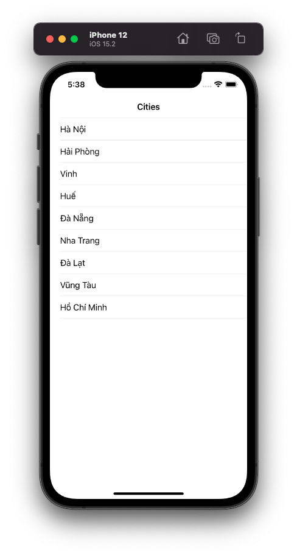
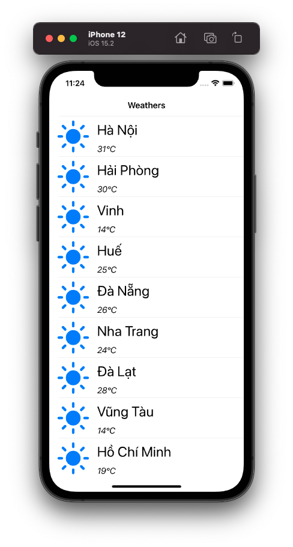
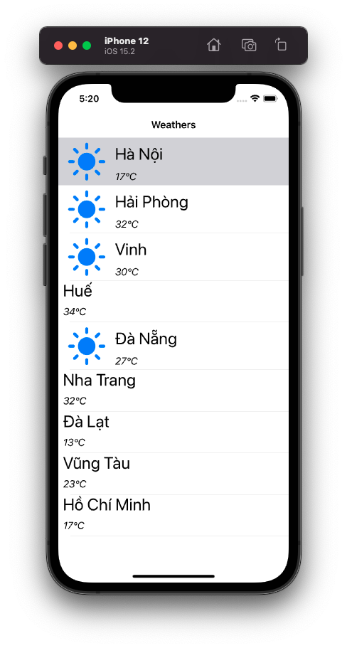

# Display a basic TabView with RxSwift

Chào bạn đến với Fx Studio. Đối tượng đầu tiên chúng ta cần luyện tập, đó chính là **UITableView**. TableView là đối tượng mà bạn luôn sử dụng trong hầu hết các iOS Project. Và với RxSwift, bạn sẽ có được một cách mới **rất nhanh** để hiển thị một TableView & rất **xịn sò** nữa. Ngoài ra, bạn có thể áp dụng tương tự cho **UICollectionView**, vì chúng tương đồng với nhau về bản chất.

Còn nếu mọi việc đã ổn rồi, thì ...

> Bắt đầu thôi!

## Chuẩn bị

Về tools, chúng ta sử dụng các công cụ và thư việc với version đề xuất như sau:

* Xcode 12.x
* Swift 5.x
* RxSwift 6.x
* RxCocoa 6.x

Về kiến thức, bạn cần hiểu được các kiến thức Reactive Programming trên iOS, hay chính là RxCocoa nhóe!

Về mặt demo, bạn cần phải tạo một iOS Project và tiến hành install RxSwift & RxCocoa cho nó thông qua CocoaPod (hoặc thứ khác vẫn ...). Giao diện thì khá đơn giản với một ViewController & TableView mà thôi.

## Display a list

Chúng ta sẽ bắt đầu việc thực hành với một TableView đơn giản trước nhóe. Công việc này sẽ hiển thị một danh sách đơn giản mà thôi.

### Import

Đầu tiên, bạn cần `import` các thư việc Rx mà bạn sẽ dùng.

```swift
import RxSwift
import RxCocoa
```

Tiếp theo, chúng ta cần các thuộc tính cho ViewController của chúng ta.

```swift
@IBOutlet weak var tableView: UITableView!
private var bag = DisposeBag()
private var cities = ["Hà Nội","Hải Phòng", "Vinh", "Huế", "Đà Nẵng", "Nha Trang", "Đà Lạt", "Vũng Tàu", "Hồ Chí Minh"]
```

Trong đó,

* `tableView` là Outlet của bạn để hiển thị danh sách
* `bag` là túi rác quốc dân huyền thoại. Nơi chưa các subscription. Nếu bạn đã quên, thì nó sẽ giúp bạn giải phóng đi các observable khi đối tượng được giải phóng.
* `cities` là dữ liệu của chúng ta, được dùng để hiển thị lên TableView

### Bind

Tiếp theo, bạn sẽ sử dụng RxSwift một cách đơn giản như sau:

```swift
    override func viewDidLoad() {
        super.viewDidLoad()
        
        // title
        title = "Cities"
        
        // register cell
        tableView.register(UITableViewCell.self, forCellReuseIdentifier: "cell")
        
        // create observable
        let observable = Observable.of(cities)
        // bind to tableview
        observable
            .bind(to: tableView.rx.items(cellIdentifier: "cell", cellType: UITableViewCell.self)) { (index, element, cell) in
                cell.textLabel?.text = element
            }
            .disposed(by: bag)
    }
```

Trong đó:

* Chúng ta sẽ biến đổi Array String `cities` thành một Observable, bằng toán tử `of`
* Vì là một Observable rồi, nên ta có thể `bind` từng phần tử lên thuộc tính `items` trong không gian `rx` của TableView (cái này có trong RxCocoa).
* các tham số của phương thước `bind` chính là `identifier` cho cell. Nên đảm bảo việc reusable thì bạn cần `register` cell trước.

Và chỉ đơn giản vậy thôi. Bạn hãy build thử cả cảm nhận kết quả nhóe.



> Bạn sẽ bắt đầu quên đi DataSource Protocl của TableView được rồi!

### Emit Data

Bạn sẽ cảm nhận ngay sự khác biết giữa cách làm truyền thống với các Protocol. Khi đó, ViewController của bạn sẽ chịu trách nhiệm chính trong việc phân phối dữ liệu tới các TableView.

Dữ liệu được cung cấp tại các function của UITableViewDataSource Protocol. Chúng ta sẽ `return` dữ liệu tương ứng với các vị trí (indexPath) & reusable cell.

Còn với RxSwift hay Reactive Programming thì sẽ khác. Một Observable nào đó sẽ đảm nhận công việc phân phối dữ liệu tới các TableView. Và ViewController chỉ cần nắm giữ subcription của công việc đó thôi.

Observable sẽ lần lượt `emit` dữ liệu đi. Chúng ta sẽ tạo một cầu nối `bind` giữ Observable & TableView. Rồi từ đó mọi thứ sẽ tự động triển khai. Đối tượng nhận các dữ liệu gởi đi từ Observable, chính là các Binder từ không gian `rx` của TableView. Trong đoạn code trên là `items`.

Tất cả tạo nên một thứ gọi là:

> Liền mạch logic code của bạn.

Nó không phải là một kỹ thuật dễ hiểu cho các bạn newbie. Nhưng nó giúp các bạn tiếp cận nhanh hơn theo mạch code triển khai. Mà không phải suy nghĩ nhiều như mô hình Delegation với DataSource trước đây.

## Handle Events

Tại phần trên, chúng ta đã không cần tới DataSource Protocol của TableView nũa rồi. Nhưng vẫn còn một phần quan trọng nữa, đó là các sự kiện người dùng tác động lên UI. Và TableView thì cũng ta ít nhất cũng phải bắt được các sự kiện này. Ví dụ như:

* Selected Cell
* Move Cell
* Delete Cell

### Model Selected

Chúng ta sẽ bắt lấy sự kiện đơn giản nhất nhóe. Chính là việc chọn một cell của TableView. Bạn tham khảo đoạn code sau nhóe!

```swift
        tableView.rx
            .modelSelected(String.self)
            .subscribe(onNext: { element in
                print("Selected \(element)")
            })
            .disposed(by: bag)
```

Trong đó:

* Bạn vẫn sử dụng không gian `rx` của TableView
* Observable lần này sử dụng là `modelSelected`

Bạn tưởng tượng là sẽ chạm vào phần tử dữ liệu (hay gọi là model). Do đó, kiểu của model thì phải được cung cấp cho Observable. Trong ví dụ, ta sử dụng kiểu dữ liệu là String.

Cuối cùng, mọi thức còn lại là bạn `subscribe` nó mà thôi. Và ném subscription vào túi ra quốc dân.

Build và cảm nhận kết quả nhóe!

Các cộng việc này chính là khai báo:

* Bạn khai báo dữ liệu bind cho TableView
* Bạn lắng nghe dữ liệu phát ra khi chọn vào cell

Đó là bản chất chính của Reactive Programming. Và chúng ta xem lại toàn bộ code của TableView đơn giản này.

```swift
import UIKit
import RxSwift
import RxCocoa

class CitiesViewController: UIViewController {
    
    @IBOutlet weak var tableView: UITableView!
    
    private var bag = DisposeBag()
    private var cities = ["Hà Nội","Hải Phòng", "Vinh", "Huế", "Đà Nẵng", "Nha Trang", "Đà Lạt", "Vũng Tàu", "Hồ Chí Minh"]

    override func viewDidLoad() {
        super.viewDidLoad()
        
        // title
        title = "Cities"
        
        // register cell
        tableView.register(UITableViewCell.self, forCellReuseIdentifier: "cell")
        
        // create observable
        let observable = Observable.of(cities)
        // bind to tableview
        observable
            .bind(to: tableView.rx.items(cellIdentifier: "cell", cellType: UITableViewCell.self)) { (index, element, cell) in
                cell.textLabel?.text = element
            }
            .disposed(by: bag)
        
        // selected cell
        tableView.rx
            .modelSelected(String.self)
            .subscribe(onNext: { element in
                print("Selected \(element)")
            })
            .disposed(by: bag)
    }
}
```

Bạn cũng dễ thấy được 1 điều là tất cả code đều có thể dồn vào function đầu tiên chạy mà thôi.

### Item Deselected

Ở trên là dành cho Model, còn với item thì bạn cũng có các phương thức tương tự. Lần này, mình sẽ ví dụ với item nhưng sẽ là `deselected` cho nó chút khác biệt nhóe.

Bạn cũng tiếp tục thêm đoạn code này vào sau:

```swift
        tableView.rx
            .itemDeselected
            .subscribe(onNext: { indexPath in
                print("Deselected with indextPath: \(indexPath)")
            })
            .disposed(by: bag)
```

Về bản chất, nó cũng tương tự cách trên. Tuy nhiên, khi bạn tiến hành `subscibe` với `itemDeselected` thì chúng ta sẽ có tham số là `indexPath`. Đó cũng chính là IndexPath huyền thoại xuất hiện lâu nay trong TableView. Có được nó thì chúng ta có được tất cả nhóe. Bạn có thể dùng tương tác dữ liệu hay sắp xếp lại cell ...

Còn để thấy sự đơn giản bạn hãy build lại project và tiếp tục cảm nhận kết quả tiếp nhóe.

### Event Observables

Ngoài ra, RxCocoa cũng cung cấp cho bạn kha khá các Observable hữu dụng khác cho việc quản lý các sự kiện người dùng. Ví dụ:

* modelSelected(_:), modelDeselected(_:), itemSelected, itemDeselected : khi tương tác với item và cell của TableView
* modelDeleted(_:) : sự kiện delete 
* itemAccessoryButtonTapped : khi người dùng chạm vào các button Accessory của cell
* itemInserted, itemDeleted, itemMoved : các sự kiện EditMode của TableView
* willDisplayCell, didEndDisplayingCell : các cell hiển thị và mất đi, một đặc trưng của reusable trong TableView

Với chừng này thứ thì bạn hoàn toàn có thể an tâm mà chiến đấu với RxSwift nhóe!

## Reusable Cell

Chúng sẽ sẽ không sử dụng các UITableViewCell mặc định nhiều. Bạn phải tự tạo một Reusable Cell của riêng bạn và dùng nó để hiển thị trên TableView.

Với RxSwift cho trường hợp này thì cũng tương tự với Cell mặc định của UIKit. Bạn sẽ làm lại các bước như ở trên với một ViewController mới nhóe.

Bước 1: register cell mới. Chúng ta sẽ dùng phương pháp đăng ký với file Nib cho Reusable Cell.

```swift
        let nib = UINib(nibName: "WeatherCell", bundle: .main)
        tableView.register(nib, forCellReuseIdentifier: "cell")
```

Bước 2: Vẫn là bind dữ liệu lên TableView. Nhưng lần này `cellType` sẽ là class của Reusable Cell nhóe.

```swift
    func bindTableView() {
        let citiesObservable = Observable.of(citiesName)
        
        citiesObservable
            .bind(to: tableView.rx.items(cellIdentifier: "cell", cellType: WeatherCell.self)) { (index, element, cell) in
                cell.cityNameLabel.text = element
                cell.tempLable.text = "\(Int.random(in: 10...35))°C"
            }
            .disposed(by: bag)
    }
```

Với `citiesName` là một String Array. Việc xử lý còn lại thì tương tự như ở phần trên.

Như vậy là ổn rồi, bạn build lại ứng & cảm nhận kết quả nhóe!



## Set Delegate

Chúng ta vẫn còn một protocol nữa của TableView mà bạn hay sử dụng. Đó chính là UITableViewDelegate Protocol. Các function của Delegate Protocol đóng vài trò thông báo về trạng thái & cũng phản hồi lạ các tác động của người dùng.

Bạn sẽ không cần phải lo lắng quá nhiều tới các function có trong Protocol này. Bạn vẫn có thể dùng hợp cách code truyền thống với Reactive Programming.

Bắt đầu, bạn chỉ cần khai báo thêm như sau cho đối tượng UITableView của bạn trong không gian `rx`.

```swift
        tableView.rx
            .setDelegate(self)
            .disposed(by: bag)
```

Đây chính là cách bạn tạo nên các Proxy Delegate trong không gian `rx`. Sau khi, bạn đã có `delegate` rồi. Bạn cần phải conform Protocol cho chính ViewController của bạn. Xem ví dụ sau:

```swift
extension WeathersViewController: UITableViewDelegate {
    func tableView(_ tableView: UITableView, didSelectRowAt indexPath: IndexPath) {
        print("Did selected TableView with \(indexPath)")
    }
}
```

Đơn giản như vậy. Bạn vẫn có thể sử dụng lại các function có trong Delegate Protocol, mà không cần quá lo lắng. Hãy build lại project và cảm nhận kết quả nhóe!

## Multiple Cells

Vấn đề cơ bản cuối cùng là việc bạn phải sử nhiều loại cell khác nhau trong cùng một TableView.

Đầu tiên, bạn cần phải đăng ký các Resuable Cell mà bạn muốn sử dụng.

```swift
        let nib1 = UINib(nibName: "WeatherCell", bundle: .main)
        tableView.register(nib1, forCellReuseIdentifier: "cell1")
        
        let nib2 = UINib(nibName: "WeatherWithoutStatusCell", bundle: .main)
        tableView.register(nib2, forCellReuseIdentifier: "cell2")
```

Về cách giải quyết vấn đề, thì RxSwift cũng tương đồng với cách truyền thống. Bạn cần phân biệt các đối tượng Resuable Cell tương ứng với dữ liệu.

Ví dụ như sau:

```swift
    func bindTableView() {
        let citiesObservable = Observable.of(citiesName)
        
        citiesObservable
            .bind(to: tableView.rx.items) { (tableView, index, element) in
                let randomStatus = Bool.random()
                let indexPath = IndexPath(row: index, section: 0)
                if randomStatus {
                    let cell = tableView.dequeueReusableCell(withIdentifier: "cell1", for: indexPath) as! WeatherCell
                    cell.cityNameLabel.text = element
                    cell.tempLable.text = "\(Int.random(in: 10...35))°C"
                    return cell

                } else {
                    let cell = tableView.dequeueReusableCell(withIdentifier: "cell2", for: indexPath) as! WeatherWithoutStatusCell
                    cell.cityNameLabel.text = element
                    cell.tempLable.text = "\(Int.random(in: 10...35))°C"
                    return cell

                }
            }
            .disposed(by: bag)
    }
```

Trong đó:

* Chúng ta vẫn `bind` dữ liệu từ Observable lên TableView
* Sử dụng hàm `bind` khác và không cần tới các Identifier
* Trong closure bạn sẽ sử dụng lại các cell bằng việc gọi `tableView.dequeueReusableCell()`
* Sau đó, bạn sẽ tìm cách phân loại các dữ liệu tương ứng với các Cell khác nhau

Hãy build lại project và cảm nhận kết quả nhóe.



> EZ Game!

## Tạm kết

* Hiển thị danh sách đơn giản lên TableView
* Binding dữ liệu lên TableView
* Quản lý các sự kiện người dùng
* Tích hợp với các function của Delegate Protocol
* Hiển thị nhiều loại cell khác nhau

---

*Cảm ơn bạn đã theo dõi các bài viết từ Fx Studio & hãy truy cập [website](https://fxstudio.dev/) để cập nhật nhiều hơn.*