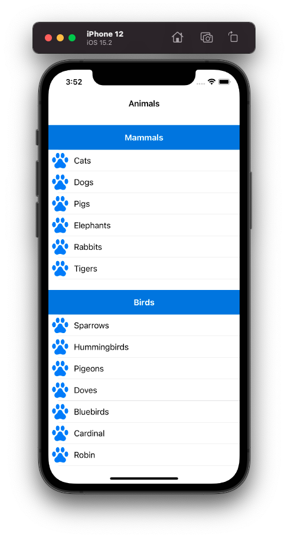

# RxDataSource - TableView with Section

Chào mừng bạn đến với Fx Studio. Chúng ta tiếp tục phiêu lưu trong vũ trụ RxSwift. Chủ đề của bài viết này là về làm việc với Section trong UITableView. Bên cạnh việc áp dụng RxSwift & RxCocoa, thì ta sẽ áp dụng thêm RxDataSource. Với mục đích đơn giản hóa hơn nữa thao tác & quản lý dữ liệu cho TableView.

Còn nếu mọi việc đã ổn rồi, thì ...

> Bắt đầu thôi!

## Chuẩn bị

Về tools, chúng ta sử dụng các công cụ và thư việc với version đề xuất như sau:

* Xcode 12.x
* Swift 5.x
* RxSwift 6.x
* RxCocoa 6.x

Về kiến thức, bạn cần hiểu được các kiến thức Reactive Programming trên iOS, hay chính là RxCocoa nhóe!

Về mặt demo, bạn cần phải tạo một iOS Project và tiến hành install RxSwift & RxCocoa cho nó thông qua CocoaPod (hoặc thứ khác vẫn ...). Giao diện thì khá đơn giản với một ViewController & TableView mà thôi.

## RxDataSource

### Vấn đề

Trước tiên, chúng ta cần xem lại cách tương tác với TableView bằng RxCocoa. Bạn sẽ có các function sau để sử dụng.

```swift
rx.items(dataSource:protocol<RxTableViewDataSourceType, UITableViewDataSource>)
rx.items(cellIdentifier:String)
rx.items(cellIdentifier:String:Cell.Type:_:)
rx.items(_:_:)
```

Nhìn qua bạn sẽ rối não. Nhưng tiếp theo với việc triển khai thì sẽ vừa hiện đại vừa thủ công. 

```swift
let data = Observable<[String]>.just(["first element", "second element", "third element"])

data.bind(to: tableView.rx.items(cellIdentifier: "Cell")) { index, model, cell in
  cell.textLabel?.text = model
}
.disposed(by: disposeBag)
```

Đi kèm với việc bind dữ liệu lên TableView thì bạn phải tạo và quản lý các cell cho nó. Với những bạn newbie mà tiếp cận RxSwift quá sẽ sẽ bị

> Loạn não cmnr!

Độ phức tạp sẽ càng tăng thêm khi TableView của bạn có thêm nhiều Section. Và RxDataSource sẽ là giải pháp tối ưu dành cho bạn. 

### Giải pháp

Đây là một trong những thư viện phổ biến trong cộng đồng RxSwift nói chung. Bạn có thể checkout nó tại link [này](https://github.com/RxSwiftCommunity/RxDataSources).

RxDataSource sử dụng cho các đối tượng UITableView & UICollectionView thay cho việc quản lý hiển thị các cell bằng DataSource Protocol trước đây. Ngoài ra, giúp cho việc sử dụng với RxCocoa thuần túy trở nên đơn giản hơn.

Với giải pháp từ một đối tượng DataSource chung nhất thì sự biến đổi của TableView sẽ đi theo.

> Tương tự như với Diffable DataSource của UIKit.

Ví dụ như sau:

```swift
let dataSource = RxTableViewSectionedReloadDataSource<SectionModel<String, Int>>(configureCell: configureCell)
Observable.just([SectionModel(model: "title", items: [1, 2, 3])])
    .bind(to: tableView.rx.items(dataSource: dataSource))
    .disposed(by: disposeBag)
```

Các cấu hình về Cell & Data cho Tableview sẽ được bạn khai báo tại một đối tượng duy nhất. Việc còn lại bind cho TableView chỉ còn đơn giản là.

```swift
Observable.just(sections)
  .bind(to: tableView.rx.items(dataSource: dataSource))
  .disposed(by: disposeBag)
```

Nó giúp bạn tập trung vào bản chất Reactive Programming nhiều hơn, đó là 

> Khai báo

Về cách cài RxDataSource cũng khá đơn giản, bạn thêm vào Podfile như sau:

```shell
pod 'RxDataSources', '~> 5.0'
```

Chi tiết cách dùng như thế nào thì bạn sẽ tìm hiểu các phần sau nhóe!

## Import

Sau khi bạn đã tiến hành cập nhật Pod với thư viện RxDataSource. Và khi bạn muốn sử dụng nó, bạn sẽ import đầy đủ các thư viện như sau:

```swift
import RxSwift
import RxCocoa
import RxDataSources
```

## Define Model & Create Data

### Define Model

Một thực tế cuộc sống thì dữ liệu thường sẽ phức tạp. Bạn không thể sử dụng các kiểu dữ liệu đơn giản cho một TableView với nhiều Sections. Hoặc khi một cell của bạn lại hiểu thị nhiều thông tin.

Đi kèm với đó, mỗi thư viện lại yêu cầu bạn tạo những kiểu model phù hợp cho nó. Và RxDataSource cũng như vậy. Các đối tượng model của bạn cần phải thỏa mãn **SectionModelType Protocol**.

Chúng ta bắt đầu ví dụ khai báo có model đóng vai trò là Item. 

```swift
struct Animal {
    var name: String
}
```

Cũng khá là đơn giản cho struct Animal. Tiếp theo, bạn cần khai báo tiếp Model cho Section. Xem tiếp ví dụ như sau:

```swift
struct AnimalSection {
    var header: String
    var items: [Item]
}

extension AnimalSection: SectionModelType {
    typealias Item = Animal
    
    init(original: AnimalSection, items: [Item]) {
        self = original
        self.items = items
    }
}
```

Trong đó:

* AnimalSection là model đại diện cho Section được sử dụng
* Nó phải thỏa mãn SectionModelType Protocol. Bạn có thể sử dụng lại các struct/class trước đây và `extension` thêm mà thôi.
* Bạn cần khai báo với 2 thuộc tính `header` & `items`

Kiểu của Item sẽ được định nghĩa trong `typealias` ở phần mở rộng. Và với `items` sẽ là một Array với kiểu dữ liệu khai báo trong `typealias` đó. 

Với ví dụ trên, ta sẽ có AnimalSection tương ứng với SectionModle<String,String>. 

### Create Data

Ví dụ cách khai báo SectionModleType như trên thì bạn vẫn có thể không cần khai báo. Vì nó chứa toàn kiểu dữ liệu đơn giản. Bạn có thể sử dụng class SectionModel để tạo dữ liệu trực tiếp vẫn được.

Xem ví dụ (không liên quan tới ví dụ trên nhóe)!

```swift
        let items = Observable.just([
            SectionModel(model: "Mobile", items: [
                "iOS",
                "Android",
                "Flutter",
                "ReactNative"
            ]),
            SectionModel(model: "Web", items: [
                "PHP",
                "Ruby",
                "NodeJS",
                "Java",
                "Python",
                "Golang"
            ])
        ])
```

Còn với cách khai báo các model cho SectionModel thì bạn vẫn tạo các đối tượng dữ liệu đúng với khai báo. Tham khảo đoạn code sau luôn nhóe!

```swift
    let sections = [
        // section #1
        AnimalSection(header: "Mammals",
                      items: [
                        Animal(name: "Cats"),
                        Animal(name: "Dogs"),
                        Animal(name: "Pigs"),
                        Animal(name: "Elephants"),
                        Animal(name: "Rabbits"),
                        Animal(name: "Tigers")
                      ]),
        // section #2
        AnimalSection(header: "Birds",
                      items: [
                        Animal(name: "Sparrows"),
                        Animal(name: "Hummingbirds"),
                        Animal(name: "Pigeons"),
                        Animal(name: "Doves"),
                        Animal(name: "Bluebirds"),
                        Animal(name: "Cardinal"),
                        Animal(name: "Robin"),
                        Animal(name: "Goldfinch"),
                        Animal(name: "Herons"),
                        Animal(name: "Ducks")
                      ])
    ]
```

Ưu điểm là nó dễ nhìn hơn mà thôi! Về bản chất nói chung thì chúng vẫn là các

> Array của Array

## DataSource

Tiếp theo, chính là nhân vật chính của chúng ta. Bạn sẽ cần khai báo một đối tượng DataSource. Với RxDataSource thì sẽ cung cấp cho bạn 2 kiểu DataSource chính:

* RxTableViewSectionedAnimatedDataSource
* RxCollectionViewSectionedAnimatedDataSource

Trong phạm vi bài viết, chúng ta sẽ tập trung vào RxTableViewSectionedAnimatedDataSource. Và chúng ta sẽ khai báo như ví dụ sau:

```swift
    let dataSource = RxTableViewSectionedReloadDataSource<AnimalSection> (
        // cell
        configureCell: { dataSource, tableView, indexPath, item in
            let cell = tableView.dequeueReusableCell(withIdentifier: "cell", for: indexPath) as! AnimalCell
            cell.nameLabel.text = item.name
            return cell
        }
    )
```

Trong đó:

* DataSource cần một kiểu dữ liệu cho Generic. Đó là model chúng ta khai báo ở phần trên.
* Bạn sẽ cung cấp 1 closure cho `configureCell`
* Sử dụng một custom Resuable Cell cho TableView, là AnimalCell với identifier là `cell`. Bạn cần phải `register cell` tương ứng như vậy nhóe!

Tại đó, bạn sẽ khai báo tương tự như function `cellForRow` của UITableViewDelegate.

Ngoài ra, với các khai báo thêm cho DataSource như Header & Footer cũng khá đơn giản. Bạn sẽ có 2 cách khai báo thêm

* Tại khai báo của `dataSource`

```swift
        let dataSource = RxTableViewSectionedReloadDataSource<SectionModel<String, String>> (
            // for cell
            configureCell: { (dataSource, tableView, indexPath, item) in
               // ...
            },
            // for Header
            titleForHeaderInSection: { dataSource, sectionIndex in
                return dataSource[sectionIndex].model
            }
        )
```

* Gán thêm các thuộc tính cho nó

```swift
        dataSource.titleForFooterInSection = { dataSource, index in
          return "footer \(index)"
        }
```

## Binding

Tiếp theo, chính là binding dữ liệu của DataSource lên TableView. Như đã nói ở trên, công việc chúng ta đã đơn giản rồi thì càng đơn giản hơn nữa.

Tất cả chỉ còn như thế này nhóe!

```swift
        Observable.just(sections)
            .bind(to: tableView.rx.items(dataSource: dataSource))
            .disposed(by: bag)
```

Bạn cần chú ý việc `register cell` cho TableView trước nhóe! Đây là điều bắt buộc rồi.

```swift
        let nib = UINib(nibName: "AnimalCell", bundle: .main)
        tableView.register(nib, forCellReuseIdentifier: "cell")
```

Bây giờ, bạn có thể build project và cảm nhận kết quả trước nhóe!

## Custom Header

Để hoàn thiện được TableView với các Section thì bạn cần custom lại các Header. Tuy nhiên, RxDataSource chỉ cung cấp phương thức đơn giản và mặc định cho Header View mà thôi. Đó là

* titleForHeaderInSection
* titleForFooterInSection

Còn cao cấp hơn, bạn cần phải sử dụng thêm các function Delegate của TableView. Bắt đầu, bạn cần `setDelegate` cho TableView nhóe!

```swift
        tableView
          .rx.setDelegate(self)
          .disposed(by: bag)
```

Tiếp theo, bạn tiến hành mở rộng ViewController với UITableViewDelegate với các function cần cho Header View như sau:

```swift
extension AnimalsViewController: UITableViewDelegate {

    // for header
    func tableView(_ tableView: UITableView, viewForHeaderInSection section: Int) -> UIView? {
        let headerView = Bundle.main.loadNibNamed("AnimalHeader", owner: self, options: nil)?.first as! AnimalHeader
        headerView.frame = CGRect(x: 0, y: 0, width: UIScreen.main.bounds.width, height: 50)
        
        headerView.titleLabel.text = dataSource[section].header
        
        return headerView
    }
    
    func tableView(_ tableView: UITableView, heightForHeaderInSection section: Int) -> CGFloat {
        return 50
    }
    
    // for cell
    func tableView(_ tableView: UITableView, heightForRowAt indexPath: IndexPath) -> CGFloat {
        return 44
    }
}
```

Okay! tới đây bạn có thể build và cảm nhận kết quả rồi.



Vì đây là sự kết hợp của: 

> Truyền thống + Hiện đại + Cộng đồng

Nên khá là rối đối với các các bạn newbie hoặc các bạn mới tiếp cận với vũ trụ RxSwift. Nhưng tất cả cũng đều xuất phát từ cơ bản mà lên. Nắm vững nền tảng thì sẽ ổn hết à. EZ game!

## Tạm kết

* Tìm hiểu về RxDataSource
* Định nghĩa và tạo các dữ liệu cho SectionModel
* Khai báo và cấu hình cho DataSource
* Binding DataSource lên TableView
* Custom Header View bằng việc kết hợp với các Delegate Protocol của TableView

---

*Cảm ơn bạn đã theo dõi các bài viết từ Fx Studio & hãy truy cập [website](https://fxstudio.dev/) để cập nhật nhiều hơn.*