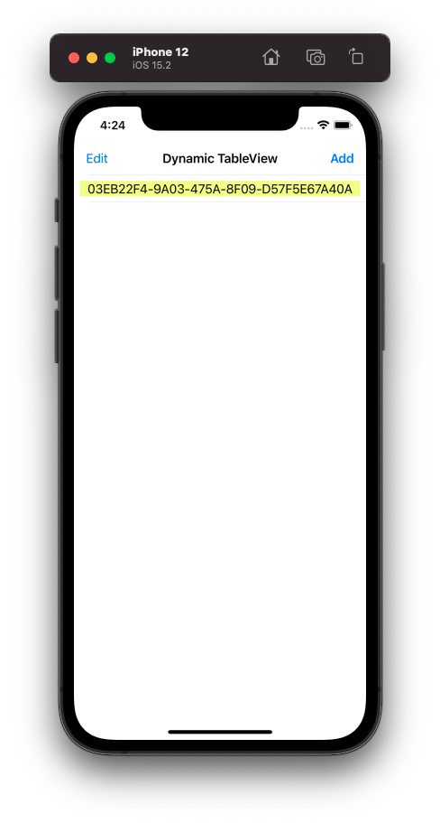
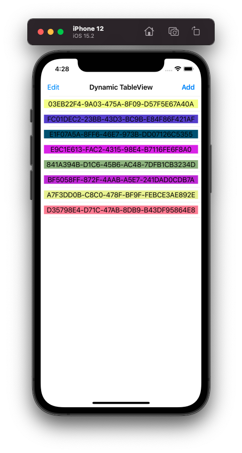
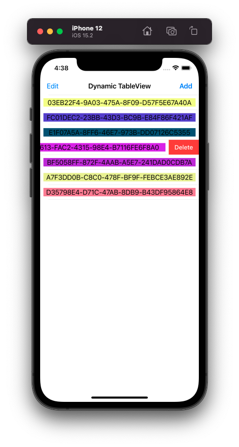
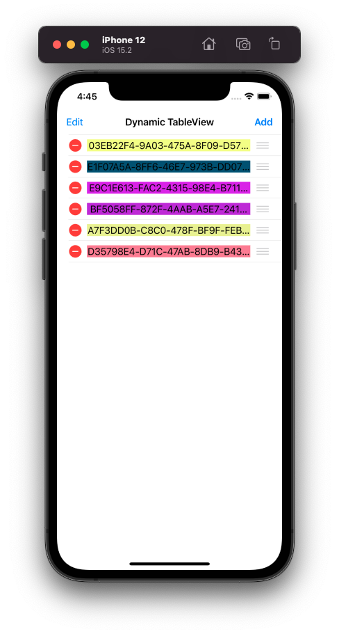
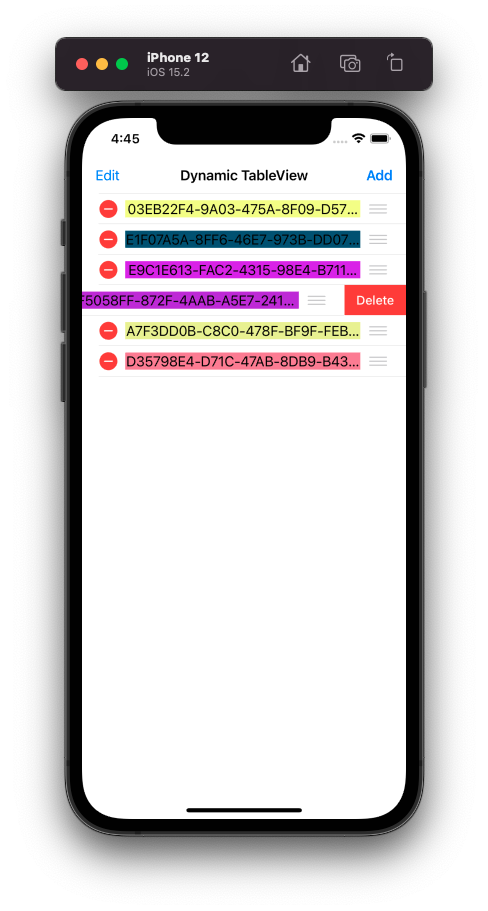

# Animated DataSources & Dynamic TableView

Chào mừng bạn đến với **Fx Studio**. Bạn đã tìm hiểu về việc sử dụng TableView với RxSwift rồi, tuy nhiên chúng vẫn là các danh sách tĩnh. Và bài viết này sẽ hướng dẫn bạn hiển thị một TableView với dữ liệu động. Tương ứng là các thao tác *thêm, sửa, xóa ...* từ người dùng. Mọi thứ sẽ được thực hiển bởi RxSwift nhóe!

Nếu bạn chưa biết gì về TableView với RxSwift, thì có thể tham khảo 2 bài viết sau:

* [Basic TableView with RxSwift](./11_1_TableView_Basic.md)
* [RxDataSource - TableView with Section](./11_2_TableView_Sections.md)

Còn nếu mọi việc đã ổn rồi, thì ...

> Bắt đầu thôi!

## Chuẩn bị

Về tools, chúng ta sử dụng các công cụ và thư việc với version đề xuất như sau:

* Xcode 12.x
* Swift 5.x
* RxSwift 6.x
* RxCocoa 6.x

Về kiến thức, bạn cần hiểu được các kiến thức Reactive Programming trên iOS, hay chính là RxCocoa nhóe!

Về mặt demo, bạn cần phải tạo một iOS Project và tiến hành install RxSwift & RxCocoa cho nó thông qua CocoaPod (hoặc thứ khác vẫn ...). Giao diện thì khá đơn giản với một ViewController & TableView mà thôi.

## Animated Data Sources

Chúng ta đã quen với thư viện RxDataSource mà đã được sử dụng trong các bài viết trước rồi. Tuy nhiên, chúng ta mới sử dụng được một đối tượng DataSource đầu tiên. Trong phạm vi bài viết này chúng ta sẽ sử dụng tiếp đối tượng **RxTableViewSectionedAnimatedDataSource** cho các TableView với dữ liệu động.

> Bạn có thể áp dụng tương tự cho UICollectionView với đối tượng **RxCollectionViewSectionedAnimatedDataSource**

Animated Data Source cung cấp kiểu nguồn dữ liệu đặc biệt & động cho các đối tương TableView. Kèm theo đó là các hiệu ứng mà bạn khai báo, khi diễn ra các sự kiện của người dụng:

* Insert
* Delete
* Move

Về bản chất, cả 2 đối tượng DataSource của thư viện đều như nhau. Về Animated Data Source thì cần kiểu dữ liệu cho Section phải tuân thủ **AnimatableSectionModelType Protocol**

Và để đảm bảo cho việc phản ứng lại với nguồi dữ liệu động thì các khai báo model cũng phải tuân thủ 2 Protocol sau:

* IdentifiableType
* Equatable

Chi tiết chúng là gì thì chúng ta sẽ tìm hiểu ở các phần sau nhóe!

## Setup View

Đâu tiên, bạn cần chuẩn bị các thứ cần thiết cho việc demo trước nhóe. Chúng ta cần 1 ViewController với 1 UITableView.

Bạn khai báo thêm các thuộc tính sau:

```swift
    @IBOutlet weak var tableView: UITableView!
    
    private var bag = DisposeBag()
```

Với `bag` là túi rác quốc dân, dùng để hủy các subscription phát sinh ra trong quá trình ViewController hoạt động.

Tiếp theo, bạn cần thêm các UIBarButtonItem để phục vụ cho các việc tác động vào dữ liệu nguồn.

```swift
        let addButton = UIBarButtonItem(title: "Add", style: .done, target: self, action: #selector(addNewItem))
        self.navigationItem.rightBarButtonItem = addButton
        let editButton = UIBarButtonItem(title: "Edit", style: .plain, target: self, action: #selector(editItems))
        self.navigationItem.leftBarButtonItem = editButton
```

Ta sẽ có 2 function tương ứng như sau:

```swift
    @objc func addNewItem() {
        // ...
    }
    
    @objc func editItems() {
        let editMode = tableView.isEditing
        tableView.setEditing(!editMode, animated: true)
    }
```

Với function `addNewItem()` ta sẽ tìm hiểu sau. Còn với `editItems()` thì đơn giản là kich hoạt chế độ EditMode của TableView mà thôi. Với việc kích hoạt `editing` thì người dùng có thể xóa và thay đổi thứ tự các cell trong TableView.

## Define Model

Chúng ta sẽ tìm hiểu cách sử dụng Animated Data Source thông qua các ví dụ code nhóe. Trước tiên, bạn cần phải định nghĩa kiểu dữ liệu mà bạn sẽ sử dụng trong Dynamic TableView của bạn.

### Item

Đầu tiên, bạn cần định nghĩa struct/class dùng là kiểu dữ liệu cho các Item trong TableView của bạn. Ta thử lấy ví dụ như sau:

```swift
struct ColorItem {
    let id = UUID()
    let color: UIColor
    
    init() {
        let red = Float.random(in: 0...1)
        let blue = Float.random(in: 0...1)
        let green = Float.random(in: 0...1)
        
        color = UIColor(red: CGFloat(red), green: CGFloat(green), blue: CGFloat(blue), alpha: 1.0)
    }
}
```

Theo quan sát, thì chúng không có gì đặc biệt, nên bạn sẽ vẫn sử dụng được các class/struct có sẵn trong project của bạn. 

Tiếp theo, chính là bạn thêm khai báo cho chúng. Để nó sẽ là Model dùng được cho các đối tượng Animated Data Source. Xem tiếp ví dụ code nhóe!

```swift
extension ColorItem: IdentifiableType, Equatable {
    typealias Identity = UUID
    
    var identity: UUID {
        return id
    }
}
```

Trong đó:

* Bạn chỉ cần mở rộng các class/struct có sẵn
* Với **IdentifiableType Protocol**, sẽ giúp bạn xác định được định danh của từng item là duy nhất trong TableView. Bạn cần xác định kiểu cho `Identity` và giá trị thuộc tính `identity` trả về.
* Với **Equatable Protocol**, sẽ giúp bạn so sánh các item với nhau, thông qua các thuộc tính của class/struct có thể so sánh được. Áp dụng cho các trường hợp delete hay move.

Tóm lại, bạn chỉ cần quan tâm tới phần `extension` và xác định các thuộc tính theo yêu cầu mà thôi.

### Section

Tiếp theo, bạn cần xác định kiểu dữ liệu dành cho Model đóng vai trò là Section trong Animated Data Source nhóe.

Chúng ta xem qua ví dụ sau tiếp nhóe!

```swift
struct ColorSection {
    var items: [Item]
}

extension ColorSection: AnimatableSectionModelType {
    typealias Item = ColorItem
    typealias Identity = Int
    
    init(original: ColorSection, items: [Item]) {
        self = original
        self.items = items
    }
    
    // Need to provide a unique id, only one section in our model
    var identity: Int {
        return 0
    }
    
}
```

Trong đó:

* Khai báo struct **ColorSection** như bình thường.
* Các khai báo dữ liệu cần cho Animated Data Source thì sẽ thực hiện ở phần `extension` của struct.
* Khai báo việc tuân thủ **AnimatableSectionModelType Protocol** và khai báo 2 kiểu dữ liệu cho **Item** & **Identity**
* Với **Identity** được dùng để phân biệt giữa các Section với nhau. Nó không liên quan gì tới **Identity** trong khai báo model Item ở trên.

Trong ví dụ, ta sẽ khai báo tiếp thuộc tính `identity` cho Model Section của Animated Data Source. Với việc trả về là `0` thì xác định duy nhất 1 section được sử dụng cho toàn bộ TableView. *(Thực chất là ví dụ thôi, chứ bạn có thể return gì ở đó cũng được nhóe)*

## Create Datas

Sau phần khai báo kiểu dữ liệu cho các Models, chúng ta tiến hành việc tạo dữ liệu sẽ sử dụng cho Animated Data Source. Ta sử dụng một ViewController và mọi thứ được nhét hết vào đó.

Bắt đầu, bạn cần dữ liệu chính TableView. Trước đây, chúng ta luôn sử dụng một Array để lưu trữ dữ liệu cho TableView. Với Animated Data Source thì ta cũng vẫn sử dụng như vậy. Xem ví dụ nhóe!

```swift
    private var colors: [ColorItem] = [
        ColorItem()
    ]
```

Cũng không có gì đặc biệt với `colors`. Tiếp đến, bạn sẽ cần 1 kiểu dữ liệu là Observable, nhưng vừa có thể phát đi các dữ liệu mới khi nguồn dữ liệu chính bị thay đổi. Từ đó, đối tượng Animated Data Source sẽ `bind` lên TableView. Dẫn tới việc thay đổi của giao diện.

Đối tượng ta sử dụng sẽ là **BehaviorRelay**. Nó hội tự tất cả các đặc điểm cần có:

* Observable
* Subject
* Emit data

Và nó đại diện cho Section. Xem tiếp ví dụ cho cho dữ liệu của Sections nhóe!

```swift
private let sections = BehaviorRelay<[ColorSection]>(value: [])
```

Chúng ta bắt đầu với một TableView chưa có bất cứ dữ liệu nào hết, thì sẽ khai báo `section` với value là 1 array rỗng.

## DataSource

Bây giờ, chúng ta sẽ đi đến nhân vật chính trong bài viết này. Đó là **RxTableViewSectionedAnimatedDataSource**. Xem qua ví dụ trước nhóe.

```swift
    private var dataSource = RxTableViewSectionedAnimatedDataSource<ColorSection>(
        animationConfiguration: AnimationConfiguration(insertAnimation: .fade,
                                                       reloadAnimation: .fade,
                                                       deleteAnimation: .fade),
        configureCell: { (dataSource, tableView, IndexPath, item) in
            let cell = tableView.dequeueReusableCell(withIdentifier: "cell", for: IndexPath) as! ColorCell
            cell.titleLabel.text = item.id.uuidString
            cell.titleLabel.backgroundColor = item.color
            return cell
        }
    )
```

Trong đó:

* `dataSource` sẽ khai báo với 2 tham số chính
* Tham số `animationConfiguration` khai báo cho hiệu ứng khi có sự thay đổi về nguồn dữ liệu. Trong ví dụ sẽ config cho 3 hiệu ứng chính là `insert`, `reload` & `delete`.
* `configureCell` thì tương dự như đối tượng DataSource ở bài viết trước. Đây chính là function `cellForRow` trong UITableViewDelegate Protocol.

Tất nhiên, bạn cũng cần phải `register cell` trước cho TableView. Vì trong ví dụ trên, mình sử dụng custom Resuable Cell nhóe!

```swift
        let nib = UINib(nibName: "ColorCell", bundle: .main)
        tableView.register(nib, forCellReuseIdentifier: "cell")
```

Đối tượng `dataSource` này sẽ đóng vai trò trung tâm cho toàn bộ TableView. Nó tiếp nhận dữ liệu từ nguồn phát và tiến hành cập nhật lên giao diện của TableView & các Cell.

## Binding

Ta sẽ đã có nguồn dữ liệu và đã có DataSource rồi. Nhiệm vụ tiếp theo là bạn tiến hành Binding dữ liệu từ nguồn lên giao diện.

Xem ví dụ code tiếp nhóe!

```swift
        sections
            .bind(to: tableView.rx.items(dataSource: dataSource))
            .disposed(by: bag)
```

Trong đó:

* `sections` là nguồn phát dữ liệu
* Ta sẽ `bind` dữ liệu lên thuộc tính `items` của TableView trong chính không gian `.rx` của nó
* Với tham số được dùng chính là `dataSource`, chịu trách nhiệm trong việc quản lý hiện thị của TableView

> Vậy, dữ liệu sẽ được phát đi như thế nào?

Để trả lời câu hỏi này, chúng sẽ sẽ chỉ cần tập trung vào `sections` mà thôi. Với các phần trên thì chúng ta xem như đã ổn với các khai báo. Các thành phần sẽ hoạt động và phản ứng theo sự thay đổi của dữ liệu nguồn. EZ Game!

Khi bạn muốn phát đi dữ liệu cho TableView thì sẽ như sau:

```swift
self.sections.accept([ColorSection(items: colors)])
```

Vì `sections` là một Relay, nên việc phát dữ liệu đi sẽ thông qua `.accept`. Còn dữ liệu vẫn được lưu trữ chính tại array `colors`. Như vậy, bạn sẽ pháp dụng cách này cho bất cứ chỗ nào bạn muốn thay đổi dữ liệu của nguồn.

Tới đây, bạn có thể build và cảm nhận kết quả rồi nhóe!



## Insert Item

Mọi thứ cài đặt và khai báo đã ổn rồi. Ta sẽ đến với hành động đầu tiên. Chính ta việc thêm các Item cho nguồn dữ liệu. Tức là thêm phần tử cho `colors` và sử dụng `sections` để phát dữ liệu mới đi.

Tại function `addNewItem()`, ta thêm các dòng code sau:

```swift
    @objc func addNewItem() {
        colors.append(ColorItem())
        self.sections.accept([ColorSection(items: colors)])
    }
```

Trong đó:

* `colors.append` là thêm dữ liệu mới vào `colors`
* `sections.accept` là phát dữ liệu mới đi
* Với value như ví dụ là`[ColorSection(items: colors)]` , thì chỉ có 1 section mà thôi.

Hãy build và cảm nhận kết quả tiếp nhóe!



*(Trên hình là mình đã bấm liên tiếp vài lần nút Add)*

## Swipe to Delete

Chúng ta có 2 cách xóa 1 cell trong TableView. Chúng ta sẽ tìm hiểu cách đơn giản trước. Đó chính là *"Swipe to Delete"*. Tức là vút để xóa.

Để thực hiện được điều này, bạn cần phải thay đổi cấu hình của `dataSource` trước. Cho phép TableView có thể chấp nhận thao tác trên.

Bạn chỉnh sửa theo đoạn code sau nhóe!

```swift
    private var dataSource = RxTableViewSectionedAnimatedDataSource<ColorSection>(
        animationConfiguration: AnimationConfiguration(insertAnimation: .fade,
                                                       reloadAnimation: .fade,
                                                       deleteAnimation: .fade),
        configureCell: { (dataSource, tableView, IndexPath, item) in
            let cell = tableView.dequeueReusableCell(withIdentifier: "cell", for: IndexPath) as! ColorCell
            cell.titleLabel.text = item.id.uuidString
            cell.titleLabel.backgroundColor = item.color
            return cell
        },
        canEditRowAtIndexPath: { (dataSource, IndexPath) in
            return true
        }
    )
```

Sau khi đã khai báo việc config cho xóa item là `canEditRowAtIndexPath` rồi. Bạn sẽ cần khai báo việc xóa như thế nào. Ta sẽ sử dụng tới không gian `.rx` của TableView.

```swift
        tableView.rx.itemDeleted
            .subscribe(onNext: { indexPath in
                self.colors.remove(at: indexPath.row)
                self.sections.accept([ColorSection(items: self.colors)])
            })
            .disposed(by: bag)
```

Trong đó:

* Bạn sẽ sử dụng tới `itemDeleted` khi TableView bị xóa đi 1 cell hay 1 item
* Sau đó bạn tiến hành `subcribe` nó và tiến hành khai báo cách giải quyết trong closure
* Công việc chỉ đơn giản là `remove` tại `indexPath` cho array `colors`
* Cuối cùng, bạn sẽ dùng `sections` phát dữ liệu mới đi

Lúc này, DataSource sẽ xử lý việc thay đổi khi dữ liệu nguồn có sự thay đổi, kèm theo hiệu ứng.

Đơn giản vậy thôi, bạn hãy build lại project & cảm nhận kết quả tiếp nhóe!



## Move Item

Cuối cùng, bạn có thể thay đổi thứ tự các cell của TableView. Kèm theo đó là sự thay đổi thứ tự dữ liệu tại nguồn. Và cũng như phần trên, bạn sẽ thêm config cho `dataSource`.

```swift
    private var dataSource = RxTableViewSectionedAnimatedDataSource<ColorSection>(
        animationConfiguration: AnimationConfiguration(insertAnimation: .fade,
                                                       reloadAnimation: .fade,
                                                       deleteAnimation: .fade),
        configureCell: { (dataSource, tableView, IndexPath, item) in
            let cell = tableView.dequeueReusableCell(withIdentifier: "cell", for: IndexPath) as! ColorCell
            cell.titleLabel.text = item.id.uuidString
            cell.titleLabel.backgroundColor = item.color
            return cell
        },
        canEditRowAtIndexPath: { (dataSource, IndexPath) in
            return true
        },
        canMoveRowAtIndexPath: { _, _ in
            return true
        }
    )
```

Với `canMoveRowAtIndexPath`, thì bạn có thể di chuyển các cell. Điều kiện chính là bạn phải kích hoạt trạng thái Edit Mode của TableView trước nhóe.

Và cũng để thực hiện việc move item, bạn cũng phải thêm khai báo xử lý cho `itemModed` của TableView tại không gian `.rx`. Xem ví dụ nhóe~

```swift
        tableView.rx.itemMoved
            .subscribe(onNext: { indexPaths in
                let item = self.colors.remove(at: indexPaths.sourceIndex.row)
                self.colors.insert(item, at: indexPaths.destinationIndex.row)
                self.sections.accept([ColorSection(items: self.colors)])
            })
            .disposed(by: bag)
```

Bạn cứ tiến hành `subcribe` và thực hiện các thao tác bên trong closure nhóe. Nó vẫn tương tự cách delete item ở trên.

Build và cảm nhận kết quả nhóe. Ta sẽ có 2 trường hợp khi kích hoạt Edit Mode.

* Move bình thường



* Kích Delete Button



## Tạm kết

* Tìm hiểu về Animated Data Source
* Hướng dẫn cách khai báo các Model dùng cho Section & Item
* Tạo dữ liệu và Observable cho phần dữ liệu của TableView
* Cấu hình DataSource cho TableView với dữ liệu động
* Xử lý các thao tác của người tác động lên nguồn dữ liệu

---

*Cảm ơn bạn đã theo dõi các bài viết từ Fx Studio & hãy truy cập [website](https://fxstudio.dev/) để cập nhật nhiều hơn.*